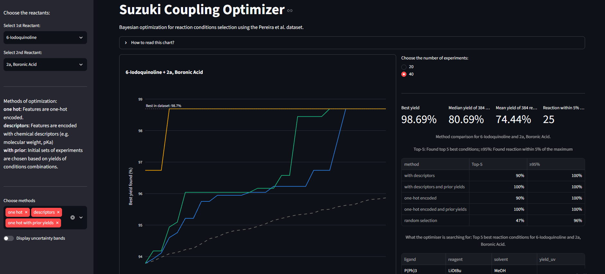

[](https://suzuki-bo.streamlit.app)

# Reaction conditions optimiser

To create a molecule, a chemist in the lab uses a condition set such as a solvent, a base and a ligand to get the best yield. However, testing every combination of those conditions is time-consuming and costly. The aim of this project was to compare the performance of an algorithm that chooses which experiment to run next based on results so far against a baseline random search.

The model used was a Gaussian process with expected improvement as its acquisition function and it was benchmarked on 15 reactant pairs from a dataset of 5760 reactions.

I built this as a self-directed project outside my coursework, to learn Bayesian optimisation and apply it to real reaction data.



## Results

Top-5: Share of runs that found top 5 best conditions; ≥95%: Share of runs that found a reaction within 5% of the maximum yield. Metrics averaged over the 15 pairs.

| Method | Top-5 found, 20 exp. | ≥95% of best, 20 exp. | Top-5 found, 40 exp. | ≥95% of best, 40 exp. |
| --- | --- | --- | --- | --- |
| Random search | 25% | 38% |43%|54%|
| BO, descriptors | 35% | 47% | 63% | 66% |
| BO, descriptors + prior | 40% | 57% |	69% | 69% |
| BO, one-hot | 45% | 57% | 84% | 78% |
| BO, one-hot + prior | 61% | 62% |	85% | 77% |


Overall, every BO method beat the random search benchmark. One-hot encoding was the main gain: about twice random search's top-5 rate after 40 experiments. Knowledge transfer of prior yields from other pairs gave an advantage early in the runs (top-5 rate 61% vs 45% against random initial experiments) but made no difference by 40 experiments.

## How does it work?

Each model is a Gaussian process with expected improvement. For methods with no knowledge transfer each run started from 10 randomly chosen experiments, whereas the ones with prior yields started with 5 random and 5 conditions with the highest prior yield values. The prior yield was the average yield the same condition combination gave for 14 other reactant pairs, excluding the pair in question to prevent data leaks.

The data was encoded using two different methods: descriptors which were the numeric chemical properties of each solvent, ligand and base (such as polarity, pKa, molecular weight); one-hot encoded data which simply marked with a boolean what ligand, base and solvent were used.

The benchmark was run over 10 seeds for each reactant pair, starting at 10 initial points and running for another 30 experiments, together counted as 40 experiments. Then two metrics were used to measure the performance of each method: top-5 found: the share of runs that had found at least one top 5 reaction; ≥95% of best: the share of runs that had found at least one reaction within 5% of the best.

## Running

After cloning the repository, run:
```console
uv sync
uv run streamlit run app.py
```
The benchmark is regenerated from `notebooks/benchmark.ipynb` and takes about 70 minutes.

## Limitations

 - Each pair and method was run 10 times therefore the per-pair figures are rough and the differences of a few points between models are within noise.
 - Prior variants start from 5 informed and 5 random experiments, whereas random search always starts from 10 random points and thus some of the early advantage of prior variants comes from a better start.
 - Prior assumes complete screens of 14 reactant pairs and actual labs would have less historical data.
 - For a few problematic pairs, the prior yields method is misled and performs worse; future work could implement weights across pairs.

## Credits

### Author 

Developed by Giorgi Karenka | [](https://www.linkedin.com/in/giorgi-karenka-a64b9a43b/) | [](https://github.com/giokar1/)

### Dataset source

Damith Perera et al., A platform for automated nanomole-scale reaction screening and micromole-scale synthesis in flow. Science 359, 429-434(2018). Accessed 06.10.2026, DOI: 10.1126/science.aap9112

### AI use

The interactive plot function plot_trajectory_plotly in baseline/plots.py was generated by Claude (Anthropic) and tested by me. Claude was further used for code review, debugging advice and benchmarking design. All the remaining code was written by me.